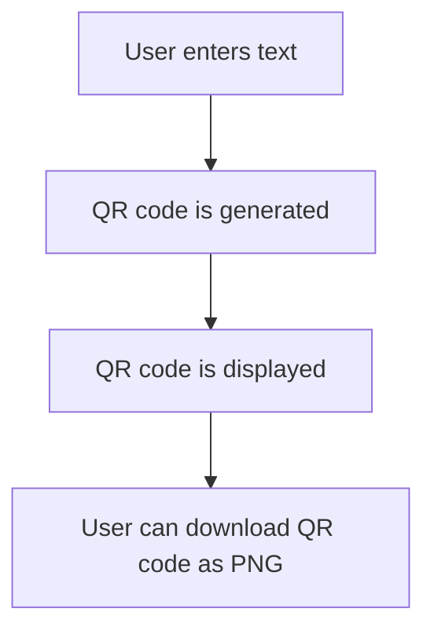

# QR Code Generator

A modern, web-based QR code generator built with Streamlit. Enter any text and instantly get a downloadable QR code image. The app features a beautiful animated background and a user-friendly interface.

## Features
- Generate QR codes from any text input
- Download QR codes as PNG images
- Stylish, animated UI
- Runs locally in your browser

## Installation

1. **Clone the repository**
   ```bash
   git clone <repo-url>
   cd text_to_qr_code_generator
   ```
2. **Install dependencies**
   ```bash
   pip install -r requirements.txt
   ```

## Usage

Run the Streamlit app:
```bash
streamlit run text_to_qr_gen.py
```

Then open the provided local URL in your browser.

## How it works



## Project Structure

- `text_to_qr_gen.py` — Main Streamlit app
- `requirements.txt` — Python dependencies

## Dependencies
- streamlit
- qrcode
- Pillow

## License

MIT License 
